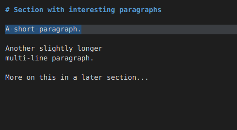
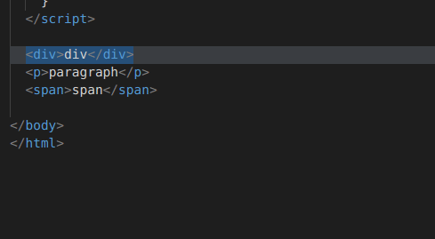

# Code-strider

## Features

This extension provides a structured navigation and editing mode.

This editing interface is **modal**. You can either navigate around the code or insert text; but not both at the same time. The navigational mode is active by default.

All keybindings are configurable. The defaults are influenced by Vim.

### Navigate complex code structures with ease

Use the arrow keys to easily move over source code fragments.
These are bound to the smart movement commands `move-up`, `move-down`, `move-left`, `move-right`, which will try to move to code-structures in the desired direction.

The commands `follow-structure` [f] and `follow-structure-last` [Shift+f] should preferably be used to navigate further *inside* a selected node.

To select the parent of the currently selected node use `move-parent` [g]. 

If any movement operation did not select your wished for node, you can return to previously selected nodes by using `back-to-previous-selection` [b]. (Note: this undo-stack is cleared when changing or modifying the file.)

#### Direct tree navigation

It is also possible to move directly on the Tree-sitter AST with the `tree-move-...` commands.
The commands `parent, next, previous, first child` are by default bound to `alt` + `h j k l` respectively.

### Perform syntax aware editing operations

#### Inserting text

- `insert-before` [i] Insert directly *before* the current node
- `insert-after` [a] Insert directly *after* the current node
- `insert-below` [o] Start inserting text on a line *below* the currently selected node
- `insert-above` [Shift-o] Start inserting text on a line *above* the currently selected node
- `delete-insert` [c] Change the currently selected node by deleting its text and entering insert-mode.

To exit insert-mode, simply press [Escape] (`exit-insert-mode`).

For convenience the default VS Code `undo` command is bound to [u].

#### Deleting nodes

- `greedy-delete` (default binding: [Backspace])
  Delete the currently targeted structure and everything around it up until the next named node.



#### Slurping and barfing

- `slurp-left` [7] Include the next sibling as last child
- `slurp-right` [8] Include the previous sibling as first child
- `barf-left` [Shift-7] Extract the last child as next sibling
- `barf-right` [Shift-8] Extract the first child as previous sibling

Currently, only useful in HTML.
While it is possible to use the commands in any language, the results are most definitely not what you would expect.
The algorithms for slurping and barfing are currently tuned for use on HTML code.

Theoretically, slurping and barfing are inverse operations, but in the current implementation line breaks are removed by the `slurping` and not restored by `barfing`.



### Supported languages

        C
        Clojure
        CSS
        Fennel
        HTML
        Java
        JavaScript
        JSON
        Markdown
        Nix
        Python
        SCSS
        TypeScript

### Inspect the abstract syntax tree (AST)

Try the AST viewer if you are curious about the abstract syntax tree of your code.
Activate it by opening the command palette [F1] and selecting the `Toggle AST viewer` command.

> Note: The AST viewer does not update during insert-mode.

## Requirements

No dependencies. This extension bundles the *WASM* builds of [Tree-sitter](https://github.com/tree-sitter/tree-sitter, thus, no native dependencies are required.

In the future I might try to integrate native tree-sitter again, but that is currently quite complicated. The extension would need to be compiled with the exact same version of VS Code where it will be used.

## Extension Settings

Currently, there are no configurable settings.

## Contributions

This extension contributes the languages `Fennel` and `Nix`. These are only partial definitions. Basically only mapping their respective file suffixes to a language identifier. This allows consistent detection of all supported languages.

### Custom commands

You can create custom key bindings which are only active during either Code-strider navigation or insert-mode. The following contexts can be used in a key binding's `when` expression:

- `code-strider:is-editor-supported` indicates whether this extension is active in the currently active text editor (this is true if the language is supported).
- `code-strider:is-insert-mode` indicates whether text insertion is active.

For example, all default key bindings active during the structured-navigation mode use this expression:

```json
  "when": "editorTextFocus && code-strider:is-editor-supported && !code-strider:is-insert-mode"
```

## Updating parsers

With help of the package manager [Nix](https://nixos.org/), the expression `build-wasm.nix` can be used to fetch and build all the latest parsers from their git repositories.

```sh
nix-build build-wasm.nix
cp ./result/*.wasm ./wasm/
```

## Known Issues

- The extension does not (re-)initialize when changing the language mode of a file.
  It is necessary to switch to another editor and back to detect the language change.

- Do not try to move the AST viewer manually. Change the editor layout instead. Otherwise the selections will not update.
  For example, use `View: Two rows editor layout` **after** opening the AST viewer to move it to the bottom row.

- The extension will crash if a file is deleted during parsing. Simply reload VS Code (Action: `Developer: Reload Window`)
